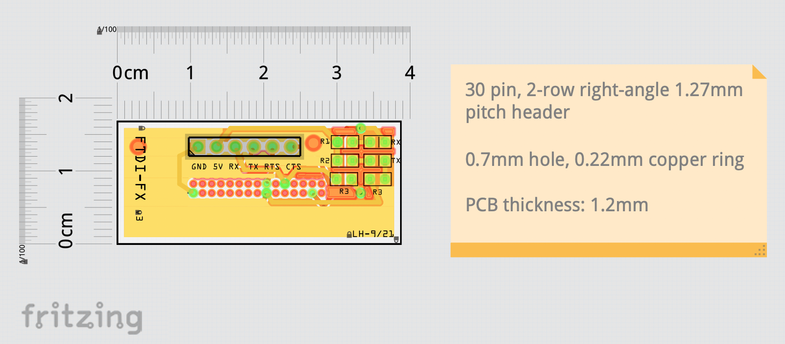

Casio2FDTI Connector
====================

This is a small PCB that allows you to connect a CASIO FX-850P/FX-850P via an FTDI USB cable to your computer (Win or Mac).

* Author: Lennart Hennigs (https://www.lennarthennigs.de)
* Copyright (C) 2021-2022 Lennart Hennigs.
* Released under the MIT license.

Description
-----------

This GIT contains the Fritzing source file and the Gerber files that allow you to get your own PCB. You'll also find the bill of material for the PCB and some more details.

Below is a picture of the completed PCB:

As you can see, I used SMD components (805) on the PCB. They are large enough to be soldered by hand. They are a few resistors and LEDs to show activity on the RX/TX lines.

Bill of Materials
----------------
- 1 x SMD805 green LED (RX)
- 1 x SMD805 blue LED (TX)
- 1 x SMD805 50 Ohm Resistor (R1)
- 1 x SMD805 0 Ohm Resistor (R2)
- 2 x SMD805 1K Ohm Resistor (R3)
- 1 x 2-row right-angle 1.27mm pitch header (2x15 pins)

- 1 x the PCB (e.g. ordered via [JLCPCB](https://jlcpcb.com/))
- 1 x FTDI FT232RL USB to TTL cable (e.g. [this one](https://www.ebay.de/itm/273461345989))

**Note**: The PCB needs to be **1.2mm thick**. Otherwise it will not fit into the connctor slot.

Details
-------

*TBD*

